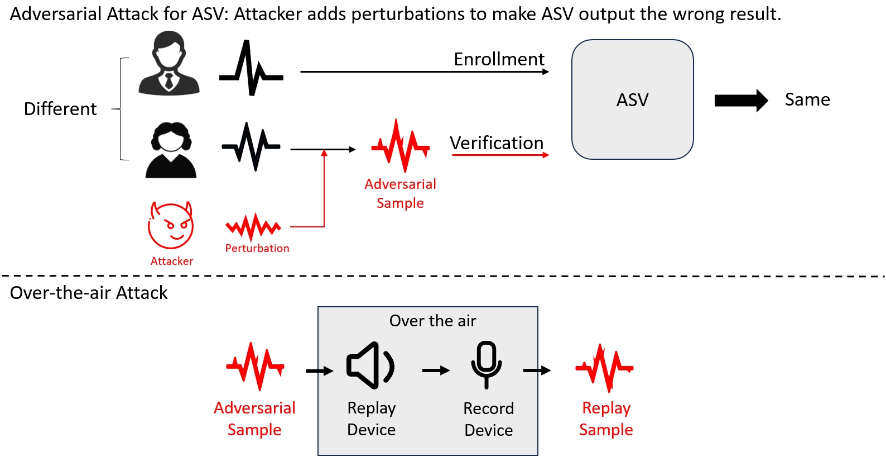

# AdvSV: An Over-the-Air Adversarial Attack Dataset for Speaker Verification



The generation of AdVSV dataset is divided into two steps, adversarial attack and over-the-air attack.

* The adversarial attack is digital in level, specifying the victim's automatic speaker verification model as well as the Attacker (adversarial attack algorithm) to generate the
  _**adversarial samples**_.
* Adversarial samples are replayed after an over-the-air attack (replay-recording) to get **_replay samples_**.

You can listen to some demos on the [demo page](https://advsv.github.io/) and check out the [paper](https://arxiv.org/abs/2310.05369).

## Abstract

It is known that deep neural networks are vulnerable to adversarial attacks. Although Automatic Speaker Verification (ASV) built on top of deep neural networks exhibits robust
performance in controlled scenarios, many studies confirm that ASV is vulnerable to adversarial attacks. The lack of a standard dataset is a bottleneck for further
research, especially reproducible research. In this study, we developed an open-source adversarial attack dataset for speaker verification research. As an
initial step, we focused on the over-the-air attack. An over-the-air adversarial attack involves a perturbation generation algorithm, a loudspeaker, a microphone, and an acoustic
environment. The variations in the recording configurations make it very challenging to reproduce previous research. The AdvSV dataset is constructed using the Voxceleb1
Verification test set as its foundation. This dataset employs representative ASV models subjected to adversarial attacks and records adversarial samples to simulate over-the-air
attack settings. The scope of the dataset can be easily extended to include more types of adversarial attacks. The dataset will be released to the public under the CC-BY
license. In addition, we also provide a detection baseline for reproducible research.

## Key Info

| Utterances | Hours | Adversarial Victim Models | Adversarial Attack Methods | Replay Devices | Record Devices |
|:----------:|:-----:|:-------------------------:|:--------------------------:|:--------------:|:--------------:|
|  387,160   |  894  |             4             |             2              |       3        |       3        |

### Adversarial Victim Models

| Abbr. in  [AdvSV paper](https://arxiv.org/abs/2310.05369) | Adversarial Victim Model |                                            Reference                                             |
|-----------------------------------------------------------|:------------------------:|:------------------------------------------------------------------------------------------------:|
| ECAPA                                                     |        ECAPATDNN         | [paper](https://www.isca-speech.org/archive/pdfs/interspeech_2020/desplanques20_interspeech.pdf) |
| RawNet                                                    |         RawNet3          |      [paper](https://www.isca-speech.org/archive/interspeech_2022/jung22_interspeech.html)       |
| ResNet                                                    |       ResNetSE34V2       |                      [paper](https://ieeexplore.ieee.org/document/9413948/)                      |
| XVec                                                      |         XVector          |                      [paper](https://ieeexplore.ieee.org/document/8461375)                       |

## Download

Please fill in the [form](https://forms.gle/XHFtvLczmSrnFNLf6). We'll promptly review and respond. Thank you for your support.

## Tag file

Confrontation samples and over-the-air samples were recorded with the [AdvSV_tag.txt](https://github.com/AdvSV/AdvSV.github.io/blob/main/AdvSV_tag.txt).
Each record has five attributes

```
File_path, Attack method, Victim ASV Model, Replay Device, Recording Device
```

Examples are shown in the table below.

| File Path                                                                                                                                         | Attack Method | Victim ASV Model    | Replay Device | Recording Device |
|---------------------------------------------------------------------------------------------------------------------------------------------------|---------------|---------------------|---------------|------------------|
| Adv/Ensemble_PGD/ResNet-ECAPA-RawNet_eps-0.008_alpha-0.0004_steps-20/id10270-5r0dWxy17C8-00001_id10270-8jEAjG6SegY-00012.wav                      | Ensemble_PGD  | ResNet-ECAPA-RawNet | NA            | NA               |
| Adv/PGD/ECAPA_eps-0.008_alpha-0.0004_steps-20/id10309-e-IdJ8a4gy4-00005_id10292-aVmHBUeThTQ-00001.wav                                             | PGD           | ECAPA               | NA            | NA               |
| OverTheAir/Low/AndroidHigh/Ensemble_PGD/XVec-ResNet-ECAPA_eps-0.008_alpha-0.0004_steps-20/id10292-gm6PJowclv0-00009_id10273-8cfyJEV7hP8-00019.wav | Ensemble_PGD  | XVec-ResNet-ECAPA   | Low           | AndroidHigh      |
| OverTheAir/Low/AndroidHigh/PGD/XVec_eps-0.008_alpha-0.0004_steps-20/id10307-120gjdqGWNQ-00004_id10292-3kzw8lTcUBU-00015.wav                       | PGD           | XVec                | Low           | AndroidHigh      |                                                                                                                                |               |                                |               |               |

### Generation of file names

The file name consists of a enrollment sample and a evaluation sample, for example id10307-120gjdqGWNQ-00004_id10292-3kzw8lTcUBU-00015.wav, id10307/120gjdqGWNQ/00004.wav (A) is the
enrollment sample, id10292/ 3kzw8lTcUBU/00015.wav (B) is the evaluation sample, and the two are different speaker voices (id10307 vs. id10292). The adversarial attack B makes the
ASV model think that A and B are the same speaker.

## Folder hierarchy

The folder hierarchy is shown below.

1. Divide adversarial attack and over the air into two folders: _Adv_ and _OverTheAir_.
2. Adv: Divided into _PGD_ and _Ensemble_PGD_, identifying the attacked speaker verification model as well as the PGD parameters.
3. OverTheAir: Identify the replay device by _High, Low, Medium_ and the recording device by _AndroidHigh, AndroidLow, iOS_.
4. Note that we also provide replay samples that have **_not_** been subjected to adversarial attacks, stored in the _Raw_ folder.

```
|-- Adv
|   |-- PGD
|   |    |-- ECAPA_eps-0.008_alpha-0.0004_steps-20
|   |    |-- RawNet_eps-0.008_alpha-0.0004_steps-20
|   |    |-- XVec_eps-0.008_alpha-0.0004_steps-20
|   |    |-- ResNet_eps-0.008_alpha-0.0004_steps-20
|   |-- Ensemble_PGD
|   |    |-- ResNet-ECAPA-RawNet_eps-0.008_alpha-0.0004_steps-20
|   |    |-- XVec-ECAPA-RawNet_eps-0.008_alpha-0.0004_steps-20
|   |    |-- XVec-ResNet-ECAPA_eps-0.008_alpha-0.0004_steps-20
|   |    |-- XVec-ResNet-RawNet_eps-0.008_alpha-0.0004_steps-20
|-- OverTheAir
|   |-- High
|   |   |-- AndroidHigh
|   |   |   |-- Raw
|   |   |   |    |-- id00012
|   |   |   |    |-- ...
|   |   |   |-- PGD
|   |   |   |    |-- ...
|   |   |   |-- Ensemble_PGD
|   |   |   |    |-- ...
|   |   |-- AndroidLow
|   |   |   |-- ...
|   |   |-- iOS
|   |   |   |-- ...
|   |-- Low
|   |   |-- ...
|   |-- Medium
|   |   |-- ...
```

## Official Data Split

If you want to follow this data split, please download the [VoxCeleb1](https://www.robots.ox.ac.uk/~vgg/data/voxceleb/vox1.html) dataset first.

The bonafide and spoof samples were recorded in [bonafide.txt](https://github.com/AdvSV/AdvSV.github.io/blob/main/bonafide.txt)
and [spoof.txt](https://github.com/AdvSV/AdvSV.github.io/blob/main/spoof.txt), respectively.
We provide splits for the training set, the development set, and the evaluation set.

Examples are shown in the table below.

| File Path(spoof.txt)                                                                                                                      | Set   |
|-------------------------------------------------------------------------------------------------------------------------------------------|-------|
| OverTheAir/Low/iOS/PGD/ResNet_eps-0.008_alpha-0.0004_steps-20/id10283-h87Y8nir1o0-00007_id10300-ize_eiCFEg0-00005.wav                     | train |
| Adv/Ensemble_PGD/XVec-ResNet-ECAPA_eps-0.008_alpha-0.0004_steps-20/id10298-hjvQiiG71rM-00026_id10285-uArtiTSTnSU-00015.wav                | train |
| OverTheAir/Low/iOS/Ensemble_PGD/XVec-ResNet-ECAPA_eps-0.008_alpha-0.0004_steps-20/id10292-3kzw8lTcUBU-00005_id10307-IASj5B-pAyM-00002.wav | dev   |
| OverTheAir/High/AndroidHigh/PGD/RawNet_eps-0.008_alpha-0.0004_steps-20/id10272-olePnztkm6U-00012_id10292-ENIHEvg_VLM-00015.wav            | eval  |

| File Path(bonafide.txt)       | Set   |
|-------------------------------|-------|
| id10533/gWHHxedxtUA/00005.wav | train |
| id11037/FKV4YA7_-YQ/00006.wav | dev   |
| id10030/DSrDNGJrN5U/00002.wav | eval  |

All data in bonafide is derived from [VoxCeleb1](https://www.robots.ox.ac.uk/~vgg/data/voxceleb/vox1.html).

In the spoof data, in order to test the performance of the out-of-domain data, the samples related to the _RawNet_ model(_RawNet, ResNet-ECAPA-RawNet, XVec-ECAPA-RawNet,
XVec-ResNet-RawNet_), the _Medium_ replay device, and the _Android High_ device, all of them are all unknown in the training phase, i.e., **they do not appear in the training set
as well as in the development set**.

The number of dataset splits is shown in the table below.

|          |   train |    dev |    eval |   total |
|----------|--------:|-------:|--------:|--------:|
| spoof    |  84,976 | 10,622 | 291,562 | 387,160 |
| bonafide |  15,351 | 15,352 | 122,813 | 153,516 |
| total    | 100,327 | 25,974 | 414,375 | 540,676 |

## License

The AdvSV dataset is released under the CC-BY license. This license enables reusers to distribute, remix, adapt, and build upon the material in any medium or format, so long as
attribution is given to the creator. The license allows for commercial use. Detailed terms can be found on [LICENSE](https://creativecommons.org/share-your-work/cclicenses/).
If you have any questions about this, please contact us via E-mail: liwang1@link.cuhk.edu.cn cc wuzhizheng@cuhk.edu.cn.

## Reference

```
@misc{wang2023advsv,
      title={AdvSV: An Over-the-Air Adversarial Attack Dataset for Speaker Verification}, 
      author={Li Wang and Jiaqi Li and Yuhao Luo and Jiahao Zheng and Lei Wang and Hao Li and Ke Xu and Chengfang Fang and Jie Shi and Zhizheng Wu},
      year={2023},
      eprint={2310.05369},
      archivePrefix={arXiv},
      primaryClass={cs.SD}
}
```

## Appendix

### A.Sample from Voxceleb1

The base dataset of AdvSV is sampled in the Voxceleb1 verification test set.
The Voxceleb1 verification test set has 37,720 data samples, each including enrollment, test sample, and a label (0 for different speakers, 1 for the same speaker).

Due to the considerable burden in subsequent replay recording, downsampling is employed on the dataset (37,720 samples) to ease this challenge.
Two data downsampling principles exist.

1. Original speaker distribution to prevent varied distributions from impacting attack results.
2. Ensures consistent SV performance between the subset and full dataset.

To implement these principles, the approach concatenates enrollment and test speaker IDs in each data entry, e.g. _0 id10270/XXXX/00001.wav id10284/XXXX/00029.wav_ becomes
_id10270-id10284_.

Then, each data ID undergoes a random 25% downsampling, preserving a quarter of the data. Notably, when downsampling reaches 0 samples, one sample is retained.
Final retained **9,083** samples, which recorded in file [veri_test_25.txt](https://github.com/AdvSV/AdvSV.github.io/blob/main/veri_test_25.txt). Currently, in order to reduce the
burden of replay recording, for the Over-the-air attack, **we only record the results of the target attack**,
i.e., the data pairs labeled as "different speakers", and the goal of the attack is to make the speaker verification model recognize them as the "same speaker".

veri_test_25.txt is a list of downsampled samples. In order to test the EER metric for automatic speaker recognition, we retained samples of the same speaker. Only attack different
speaker samples during adversarial attacks.

### B. attackResult.txt

Inside the Adv folder, information about the Adversarial sample is recorded in the attackResult.txt file.
Each record has six attributes

```
Enrollment File, Adversarial File, Is Attack Success, Original Label, Cosine Similarity, Average Perturbation
```

Examples are shown in the table below.

|      Enrollment File      |                  Adversarial File                   | Is Attack Success | Original Label |  Cosine Similarity  | Average Perturbation  |
|:-------------------------:|:---------------------------------------------------:|:-----------------:|:--------------:|:-------------------:|-----------------------|
| id10270-8jEAjG6SegY-00035 | id10270-8jEAjG6SegY-00035_id10270-5r0dWxy17C8-00021 |       True        |       1        | -0.496655136346817  | 0.0065907384268939495 |
| id10270-5r0dWxy17C8-00024 | id10270-5r0dWxy17C8-00024_id10270-OhfKF8FSq3Y-00005 |       True        |       1        | -0.5840052366256714 | 0.006569686811417341  |
